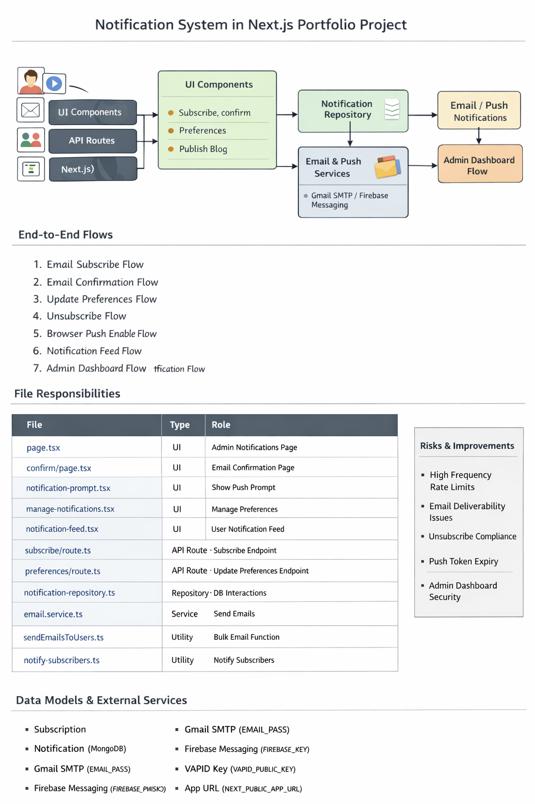

# Notifications System

This project supports three notification-related experiences:

1. Email subscriptions for new blogs, projects, and assets
2. Browser push notifications through Firebase Cloud Messaging
3. An on-site notification feed shown in the Notification Center and nav badge

The notification system is split across UI components, API routes, repository helpers, delivery services, and MongoDB models.

## High-Level Overview

At a high level, the system works like this:

1. A visitor subscribes by email or enables browser push from the site UI.
2. API routes validate and store subscriber records or push tokens.
3. Email subscribers must confirm their address before receiving updates.
4. When new content is published, the app logs a feed entry and broadcasts updates by email and push.
5. Admin pages read subscriber and token data for visibility.

## Main User Flows

### Email Subscribe Flow

1. The visitor opens the prompt rendered by `components/notifications/notification-prompt.tsx`.
2. The prompt posts the email to `app/api/notifications/subscribe/route.ts`.
3. The route uses `repositories/notification-repository.ts` to create or update a `pending` subscriber.
4. The route sends a confirmation email through `services/email.service.ts`.
5. The confirmation email HTML is generated by `utils/email-template.ts`.

### Email Confirmation Flow

1. The email contains a link to `/notifications/confirm?token=...`.
2. `app/notifications/confirm/page.tsx` reads the token from `searchParams`.
3. The page calls `confirmEmailSubscriber(...)` from `repositories/notification-repository.ts`.
4. The repository finds the matching pending subscriber, checks token expiry, and changes status to `subscribed`.
5. On success, the page shows a success state and triggers `components/notifications/confirmation-toast.tsx`.

### Update Preferences Flow

1. The user opens `components/notifications/manage-notifications.tsx`.
2. The form posts email and preference flags to `app/api/notifications/preferences/route.ts`.
3. The route checks whether the subscriber exists and is already confirmed.
4. The repository updates the saved preferences in MongoDB.

### Unsubscribe Flow

1. The user clicks an unsubscribe link or submits an unsubscribe request.
2. `app/api/notifications/unsubscribe/route.ts` accepts either `GET` or `POST`.
3. The route marks the subscriber as `unsubscribed` in MongoDB through `unsubscribeEmail(...)`.

### Browser Push Flow

1. The visitor clicks "Enable Browser Notifications" in `components/notifications/notification-prompt.tsx`.
2. The browser requests notification permission.
3. The client loads Firebase messaging from `lib/firebase.ts`.
4. The service worker `public/firebase-messaging-sw.js` is registered or reused.
5. The client gets an FCM token with `getToken(...)`.
6. The token is sent to `app/api/notifications/token/route.ts`.
7. The route stores the token through `registerPushToken(...)` in the repository.

### Notification Feed Flow

1. When content is published, the app creates a feed entry through `createNotificationFeedEntry(...)`.
2. The public Notification Center page at `app/notifications/page.tsx` reads the latest entries.
3. `components/notifications/notification-feed.tsx` renders the feed UI.
4. `lib/notifications.ts` handles local read/unread state helpers.
5. `components/navigation.tsx` uses that state to show an unread badge.

### Publish -> Notify Subscribers Flow

New content routes trigger notifications after successful create/update actions:

- `app/api/blogs/route.ts`
- `app/api/projects/route.ts`
- `app/api/assets/route.ts`

These routes call `utils/notify-subscribers.ts`, which:

1. writes a feed entry
2. loads email subscribers by preference
3. loads push tokens by preference
4. sends emails through `utils/sendEmailsToUsers.ts`
5. sends push notifications through `lib/firebase-admin.ts`
6. removes invalid push tokens from the database

### Admin Visibility Flow

1. The admin opens `app/admin/notifications/page.tsx`.
2. The page uses `useNotificationsAdmin` to request `/api/notifications/admin`.
3. `app/api/notifications/admin/route.ts` verifies the admin session through `lib/auth.ts`.
4. The route returns email subscribers and push token records for the authenticated owner.

## File Map

| File | Layer | Responsibility |
| --- | --- | --- |
| `components/notifications/notification-prompt.tsx` | UI | Entry-point prompt for email subscribe and browser push opt-in |
| `components/notifications/manage-notifications.tsx` | UI | Lets a visitor update preferences, resend confirmation, or unsubscribe |
| `components/notifications/notification-feed.tsx` | UI | Renders the Notification Center feed |
| `components/notifications/confirmation-toast.tsx` | UI | Shows a toast after successful email confirmation |
| `components/navigation.tsx` | UI | Displays unread notification badge in the site nav |
| `app/notifications/page.tsx` | Page | Public Notification Center page |
| `app/notifications/confirm/page.tsx` | Page | Email confirmation page driven by token query params |
| `app/admin/notifications/page.tsx` | Admin page | Dashboard for viewing email subscribers and push tokens |
| `app/api/notifications/subscribe/route.ts` | API route | Creates pending email subscribers and sends confirmation mail |
| `app/api/notifications/confirm/route.ts` | API route | Confirms a subscriber by verification token |
| `app/api/notifications/preferences/route.ts` | API route | Updates subscriber preference flags |
| `app/api/notifications/unsubscribe/route.ts` | API route | Marks a subscriber as unsubscribed |
| `app/api/notifications/token/route.ts` | API route | Stores browser push tokens |
| `app/api/notifications/feed/route.ts` | API route | Returns recent feed entries |
| `app/api/notifications/admin/route.ts` | API route | Returns subscriber/token data for the admin dashboard |
| `repositories/notification-repository.ts` | Repository | Central data access layer for subscriber, token, and feed operations |
| `services/email.service.ts` | Service | Sends confirmation and notification emails with Nodemailer |
| `utils/email-template.ts` | Utility | Builds HTML email templates |
| `utils/sendEmailsToUsers.ts` | Utility | Bulk email sender with retry/delay behavior |
| `utils/notify-subscribers.ts` | Utility | Orchestrates feed logging, email delivery, and push delivery |
| `utils/app-url.ts` | Utility | Resolves the base application URL for generated links |
| `lib/db.ts` | Helper | Connects to MongoDB with cached Mongoose connection state |
| `lib/firebase.ts` | Helper | Client-side Firebase messaging setup |
| `lib/firebase-admin.ts` | Helper | Server-side Firebase Admin messaging for push broadcasts |
| `lib/notifications.ts` | Helper | Read/unread helpers for feed UI state |
| `lib/auth.ts` | Auth helper | Protects admin notification APIs |
| `model/portfolio.model.ts` | Model | Defines MongoDB schemas for subscribers, push tokens, and notification logs |
| `public/firebase-messaging-sw.js` | Service worker | Receives browser push messages |

## Data Stored

### Email Subscribers

Stored through `NotificationSubscriberModel` in `model/portfolio.model.ts`.

Key fields:

- `email`
- `name`
- `status`
- `verificationToken`
- `verificationExpiresAt`
- `preferences.blogs`
- `preferences.projects`
- `preferences.assets`
- `source`

### Push Subscribers

Stored through `PushSubscriberModel`.

Key fields:

- `token`
- `preferences.blogs`
- `preferences.projects`
- `preferences.assets`
- `userAgent`
- `lastSeenAt`

### Notification Feed Entries

Stored through `NotificationLogModel`.

Key fields:

- `type`
- `title`
- `description`
- `url`
- `createdAt`

## External Dependencies and Config

### MongoDB

- `lib/db.ts` expects `MONGODB_URI`
- `MONGODB_DB` is used as the database name
- most notification operations depend on MongoDB availability

### Email Delivery

- `services/email.service.ts` uses Nodemailer
- `GMAIL_EMAIL` controls the sender address
- `GMAIL_APP_PASSWORD` is required for SMTP authentication

### Browser Push

- `lib/firebase.ts` handles client Firebase messaging
- `lib/firebase-admin.ts` handles server push sends
- `NEXT_PUBLIC_FIREBASE_VAPID_KEY` is required in the browser
- the site must run on HTTPS or localhost for push registration

### App URL Generation

- `utils/app-url.ts` and email helpers depend on a valid public base URL
- confirmation and unsubscribe links rely on that base URL being correct

## Current Strengths

- clear separation between UI, route handlers, and repository code
- confirmation-based email subscription reduces fake signups
- preferences are stored per notification type
- feed, email, and push delivery are coordinated from one utility
- admin can inspect both email and push subscriber data

## Risks and Weak Points

- notification flows depend heavily on MongoDB availability
- email subscribe and confirm are sensitive to SMTP and base-URL configuration
- push delivery depends on service worker registration and Firebase setup
- owner resolution depends on `findFirstAdmin()`, so notification data is tied to the first admin user
- publish routes need to keep calling `notifySubscribers(...)` consistently to avoid silent gaps

## Suggested Reading Order

If you want to understand the system quickly, read in this order:

1. `components/notifications/notification-prompt.tsx`
2. `app/api/notifications/subscribe/route.ts`
3. `app/notifications/confirm/page.tsx`
4. `repositories/notification-repository.ts`
5. `utils/notify-subscribers.ts`
6. `model/portfolio.model.ts`
